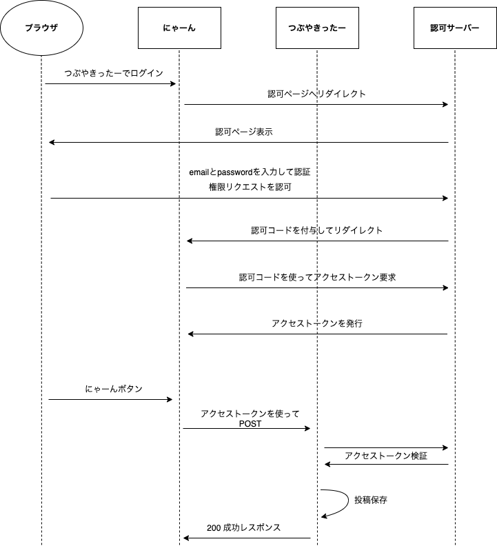
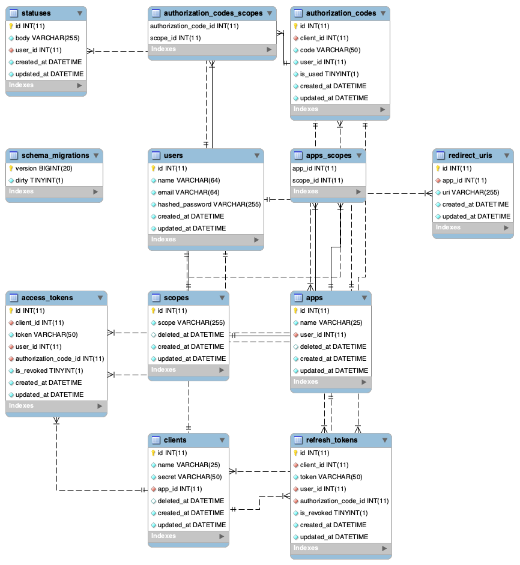

OAuth2認可サーバーを実装したのでその紹介

https://github.com/akhrszk/oauth2-example-js

## OAuth2.0について

OAuth2.0の仕様については、[RFC6749](https://datatracker.ietf.org/doc/html/rfc6749)に定義されている。
今回実装した、[サンプルアプリ](https://github.com/akhrszk/oauth2-example-js)もこの仕様に従っている。
**OpenID Foundation Japan** 様より、日本語訳もされていて、[こちら](https://openid-foundation-japan.github.io/rfc6749.ja.html)も大変助けになった。


## 実装したアプリについて

サンプルアプリは、docker-composeで立ち上がる。

```
docker-compose up
```

### サービス一覧

`docker-compose up`すると、以下の３つのサービスが立ち上がる。

サービス名|ホスト|説明
---|---|---
**にゃーん**|`localhost:3000`|ボタンを押下すると「にゃーん」と可愛い顔文字と共にポップが出るサービス
**つぶやきったー**|`localhost:9000`|つぶやきを投稿するサービス
**認可サーバー**|`localhost:9001`|つぶやきったーのOAuth2とその管理画面を提供するサービス

### シーケンス図

以下が、今回実装したサンプルアプリのシーケンス図。

**にゃーん**と**つぶやきったー**の間で**認可**のやりとりが行われ、**つぶやきったーの認可サーバー**から`アクセストークン`を取得する。その`アクセストークン`を使って**つぶやきったー**のAPIを叩き、投稿をPOSTする。
といった流れである。



## DBテーブル一覧

```
mysql> show tables;
+----------------------------+
| Tables_in_tsubuyaki        |
+----------------------------+
| access_tokens              |
| apps                       |
| apps_scopes                |
| authorization_codes        |
| authorization_codes_scopes |
| clients                    |
| redirect_uris              |
| refresh_tokens             |
| schema_migrations          |
| scopes                     |
| statuses                   |
| users                      |
+----------------------------+
```

### ER図



### 技術記事

QiitaとZennに技術記事を投稿したので、今回実装したサンプルアプリについて詳しい説明は以下を参照。

https://qiita.com/akhrszk/items/495e8f09f09dc6e569e9

https://zenn.dev/akhr_s/articles/11331882be7b8d

