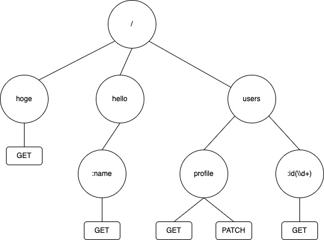

Go には `net/http` パッケージが標準で備わっており手軽に HTTP サーバーを構築することが出来ます。

```go
package main

import (
  "fmt"
  "net/http"
)

func main() {
  http.HandleFunc("/", hello)
  http.ListenAndServe(":8080", nil)
}

func hello(w http.ResponseWriter, r *http.Request) {
  fmt.Fprint(w, "Hello World!")
}
```

なんとこれだけ。

run すれば HTTP サーバーが立ち上がります。

```
go run main.go
```

便利ですね〜

しかし、実用には少しばかり機能が足りません。

### 私が思う `net/http` に足りない機能

- 正規表現による path の定義が出来ない
- path parameters を備えてない
- path の完全一致のみのルーティングを備えていない

3 つ目は何を言っているのかというと、 `net/http`のルーティングは前方一致なので、上の例だと`/`以外にも`/hoge`などもルーティングされてしまうのです。

> path の完全一致のみのルーティングを備えていない

うーん、、、これではあまりにも不便ですよね。。。

## 機能が足りないなら作ればいいじゃない

ということで、今回は Go で HTTP ルーターを自作したので、ご紹介。

GitHub のレポジトリは以下。

https://github.com/akhrszk/gorouter

### どのように実現されているのか？

宣言されたルーティグ情報を、トライ木(_trie_)と呼ばれるツリー構造で保持しており、高速なパスマッチングを実現しています。

以前、[二分探索木を JavaScript で実装](/binary-search-tree/)しましたが、あのイメージです。

[gorouter](https://github.com/akhrszk/gorouter) では、以下の機能を実現しています。

- path の完全一致のルーティング
- path parameters を取得
- 正規表現による path の宣言

## 使用方法

Handler 関数は標準の`net/http`の`w http.ResponseWriter` `r *http.Request`をそれぞれ第１引数、第２引数で受け取るのに加え、[gorouter](https://github.com/akhrszk/gorouter) では第３引数で path parameters を受け取ります。

```go
package main

import (
  "fmt"
  "net/http"

  "github.com/akhrszk/gorouter"
)

func hello(w http.ResponseWriter, r *http.Request, params gorouter.Params) {
  name := params["name"]
  fmt.Fprintf(w, "Hello, %s!", name)
}

func main() {
  r := gorouter.New()
  r.Get("/hello/:name", hello)
  http.ListenAndServe(“:3000”, r)
}
```

以上、[gorouter](https://github.com/akhrszk/gorouter)の紹介でした！
