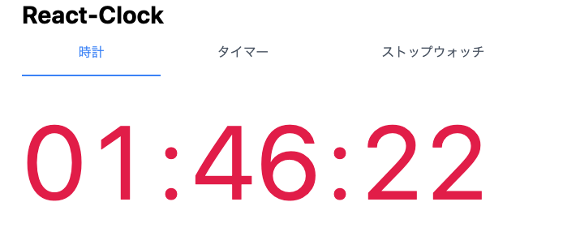

`setInterval` を React で便利に使うための `useInterval` を実装したのでご紹介。

Gist に上げたものが以下。

`gist:akhrszk/776e7f136f8c167d9e66adff1a2d63e5#useInterval.ts`

`useEffect` の内部で `setInterval` を呼び、cleanup で `clearInterval` を呼んでいる。

### 設定値

| オプション  | 説明                                                         |
| ----------- | ------------------------------------------------------------ |
| `interval`  | 実行間隔[ms]                                                 |
| `autostart` | これを`true`にすると Mount と同時に setInterval が開始される |
| `onUpdate`  | 定期実行される関数。                                         |

### 戻り値

| 値             | 説明                   |
| -------------- | ---------------------- |
| `state`        | `RUNNING` or `STOPPED` |
| `{start,stop}` | 定期実行を開始/終了    |

## 実装の解説

useInterval の実装については Qiita と Zenn に技術記事を投稿したので、詳しく知りたい方は以下を参照

- [Qiita - React で setInterval を使うためのカスタムフック useInterval を作る](https://qiita.com/akhrszk/items/e7971a5db8fb718e8818)
- [Zenn - React で setInterval を使うためのカスタムフック useInterval を作る](https://zenn.dev/akhr_s/articles/065e18ab3c4883)

## サンプルアプリ

この `useInterval` を使ってタイマーアプリを作ったものを以下のレポジトリで公開しています。

https://github.com/akhrszk/react-clock

GitHub Pages にデプロイしているので、動くものを見たい方は以下。

https://akhrszk.github.io/react-clock/
