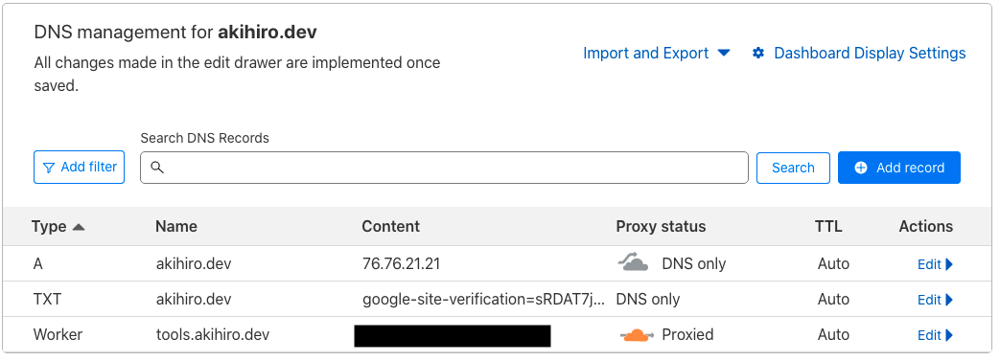

やりたいこととしては、 **GitHub Pages にデプロイされた複数のプロジェクトに同一のカスタムドメインを設定し、パスで振り分けたい。**

つまりは、

```
https://<username>.github.io/<repo>
↓
https://<カスタムドメイン>/<repo>
```

を実現したい。

単に GitHub Pages にカスタムドメインを設定したいだけであれば、レポジトリの Settings ページから**Custom domain**を設定するだけで事足りと思います。（知っての通り、basePath にリポジトリ名は付きません。）

URL に /baesPath/ でリポジトリ名を残したい場合は、Nginx などを利用してリバースプロキシする必要があります。

しかし、リバースプロキシのためだけに、Nginx でサーバーを立てるのは少々面倒です。

## Cloudflare の Workers を利用してリバースプロキシ

この記事では、Cloudflare でリバースプロキシする手順を紹介していきます。

まずは、Cloudflare にログインし、Workers タブを開いて、Worker を作成します。

エディタが開くので、以下のようなコードを書いて Deploy します。

```javascript
const baseURL = "https://<カスタムドメイン>/"

async function handleRequest(request) {
  const url = new URL(request.url)
  return fetch(`${baseURL}${url.pathname}${url.search}`, request)
}
```

Cloudflare の Workers は JavaScript で実装できるので良いですね。

（2023/03/25 時点では、何故か一度保存した Workers のコードをコンソールからエディタで編集出来ないので注意。）

## カスタムドメインを設定する

作成した Workers の詳細ページを開いて、Triggers タブを開きます。
**Add Custom Domain ボタン**を押して、設定したいドメインを入力しましょう。


すると、自動的に Cloudflare の DNS にレコードが追加されます。(Type: Worker となっているのが、今回作られたものです。)



（但し、Cloudflare のネームサーバーを利用している必要があるので、適宜ドメインレジストラからネームサーバーの設定を行ってください。）

## 完了

以上で全ての手順は終了です。

以下のそれぞれのページは別々のリポジトリで管理され GitHub Pages にデプロイされています。それを Cloudflare でリバースプロキシしています。

- https://tools.akihiro.dev/regex-checker/
- https://tools.akihiro.dev/json-formatter/
- https://tools.akihiro.dev/url-encoder-decoder/
