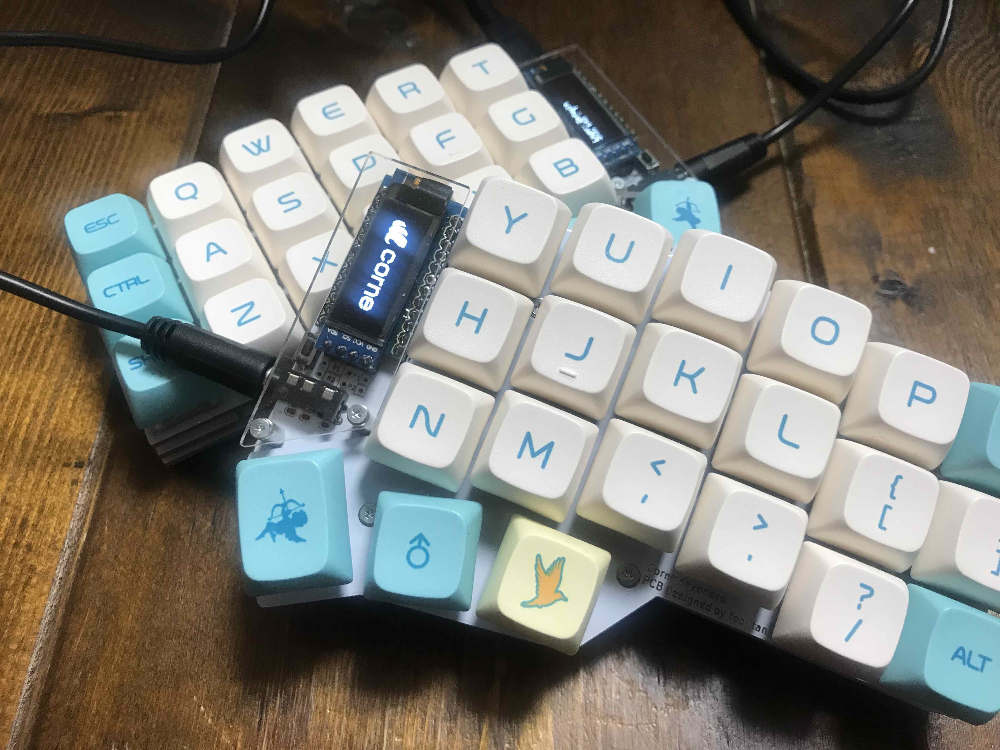
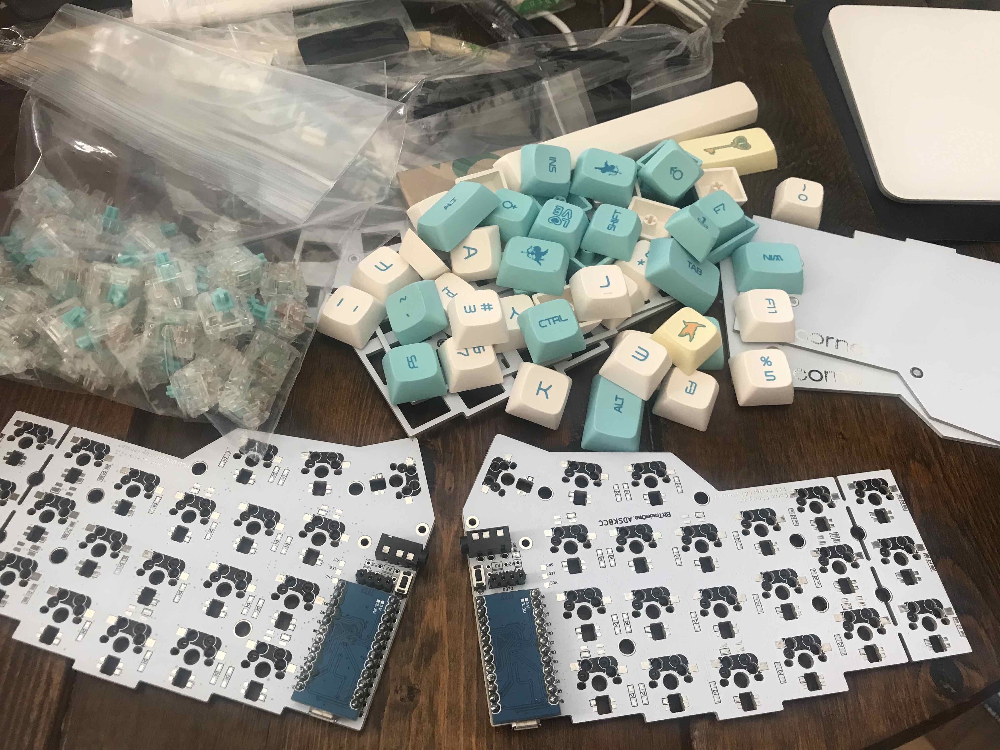
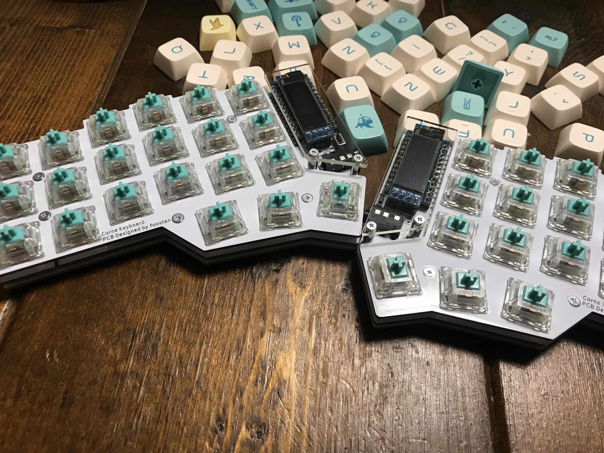

電子工作まったくの初心者ですが、今回キーボードの自作に挑戦してみました。:tada:

私も最初こそ身構えていましたが、今回購入した Corne Cherry のキットははんだ付けいらずでとても簡単に組み立てることが出来ました。（もはや電子工作と呼ぶにはおこがましい程に簡単でした 笑）

[](https://bit-trade-one.co.jp/selfmadekb/adskbcc/)

**キースイッチ**と**キーキャップ**は同梱されていないので、好みのものを選んで購入しましょう。

**ただし、基盤には MX 用のソケットが付いているため、必然的にキースイッチは MX のものを選ぶことになります。**

私は、Tealio V2 というキースイッチを購入しました。

[](https://shop.yushakobo.jp/products/a02te?variant=37665710866593)

その他に用意する物はネジを留めるためのドライバーくらいで、必要なものは全てキットに同梱されています！

## いざ、組み立て



必要なものが揃ったら、[Corne Cherry のビルドガイド](https://github.com/foostan/crkbd/blob/main/corne-cherry/doc/v3/buildguide_jp.md)に従って組み立てていきます。:muscle:

既にソケット化されているので、基板にキースイッチを嵌め込んでいくだけで OK！



## ファームウェア書き込み

キー配列を自由に決めれることが、なんと言っても自作キーボードの強みですよね

GitHub の [qmk/qmk_firmware](https://github.com/qmk/qmk_firmware) を fork しておきます。

ローカルに clone したら試しに、既に用意されている default の keymap を compile してみます。

```bash
qmk compile -kb crkbd -km default
```

すると、`.build/crkbd_rev1_default.hex`が生成されます。

[ガイド](https://github.com/foostan/crkbd/blob/main/doc/firmware_jp.md)に従って QMK Toolbox をダウンロードして、ファームウェアの書き込みを行います。（hex ファイルを開くと QMK Toolbox が立ち上がってくれます。）

## オリジナルの Keymap を作成

qmk_firmware の[公式ドキュメント](https://docs.qmk.fm/#/newbs_building_firmware?id=create-a-new-keymap)に従って、独自の Keymap を作っていきます。

```bash
qmk new-keymap -kb crkbd
```

新しく作られたディレクトリ下の`keymap.c`を編集します。

編集が終わったら compile して、先ほど行ったように QMK Toolbox を使って、ファーウェアの書き込みを行います。

```bash
qmk compile -kb crkbd -km <github_username>
```

ちなみに、[私の Keymap](https://github.com/akhrszk/qmk_firmware/blob/akhrszk/keyboards/crkbd/keymaps/akhrszk/keymap.c) は以下です。

```c
const uint16_t PROGMEM keymaps[][MATRIX_ROWS][MATRIX_COLS] = {
  [0] = LAYOUT_split_3x6_3(
  //,-----------------------------------------------------.                    ,-----------------------------------------------------.
       KC_ESC,    KC_Q,    KC_W,    KC_E,    KC_R,    KC_T,                         KC_Y,    KC_U,    KC_I,    KC_O,   KC_P,   KC_GRV,
  //|--------+--------+--------+--------+--------+--------|                    |--------+--------+--------+--------+--------+--------|
      KC_LCTL,    KC_A,    KC_S,    KC_D,    KC_F,    KC_G,                         KC_H,    KC_J,    KC_K,    KC_L, KC_LBRC, KC_RBRC,
  //|--------+--------+--------+--------+--------+--------|                    |--------+--------+--------+--------+--------+--------|
      KC_LSFT,    KC_Z,    KC_X,    KC_C,    KC_V,    KC_B,                         KC_N,    KC_M, KC_COMM,  KC_DOT, KC_SLSH, KC_RSFT,
  //|--------+--------+--------+--------+--------+--------+--------|  |--------+--------+--------+--------+--------+--------+--------|
                                           KC_TAB,   MO(1),  KC_SPC,     KC_ENT,   MO(2), KC_RCMD
                                      //`--------------------------'  `--------------------------'

  ),

  [1] = LAYOUT_split_3x6_3(
  //,-----------------------------------------------------.                    ,-----------------------------------------------------.
       KC_ESC,    KC_1,    KC_2,    KC_3,    KC_4,    KC_5,                         KC_6,    KC_7,    KC_8,    KC_9,    KC_0, KC_BSPC,
  //|--------+--------+--------+--------+--------+--------|                    |--------+--------+--------+--------+--------+--------|
      KC_LCTL, XXXXXXX, XXXXXXX, XXXXXXX, XXXXXXX, XXXXXXX,                      KC_LEFT, KC_DOWN,   KC_UP,KC_RIGHT,  KC_F11,  KC_F12,
  //|--------+--------+--------+--------+--------+--------|                    |--------+--------+--------+--------+--------+--------|
      KC_LSFT,   KC_F1,   KC_F2,   KC_F3,   KC_F4,   KC_F5,                        KC_F6,   KC_F7,   KC_F8,   KC_F9,  KC_F10, KC_RSFT,
  //|--------+--------+--------+--------+--------+--------+--------|  |--------+--------+--------+--------+--------+--------+--------|
                                           KC_TAB, _______,  KC_SPC,     KC_ENT,   MO(3), KC_RCMD
                                      //`--------------------------'  `--------------------------'
  ),

  [2] = LAYOUT_split_3x6_3(
  //,-----------------------------------------------------.                    ,-----------------------------------------------------.
       KC_ESC, KC_QUOT, KC_DQUO, KC_PEQL, XXXXXXX, XXXXXXX,                      XXXXXXX, KC_UNDS, KC_EXLM, KC_QUES, KC_PERC, KC_MINS,
  //|--------+--------+--------+--------+--------+--------|                    |--------+--------+--------+--------+--------+--------|
      KC_LCTL,   KC_AT, KC_SCLN,  KC_DLR, XXXXXXX, XXXXXXX,                      KC_HASH, XXXXXXX, XXXXXXX, KC_PLUS, KC_LPRN, KC_RPRN,
  //|--------+--------+--------+--------+--------+--------|                    |--------+--------+--------+--------+--------+--------|
      KC_LSFT, XXXXXXX, KC_ASTR, KC_COLN, XXXXXXX, XXXXXXX,                      KC_AMPR, KC_PMNS, KC_CIRC, KC_CIRC, KC_BSLS, KC_RSFT,
  //|--------+--------+--------+--------+--------+--------+--------|  |--------+--------+--------+--------+--------+--------+--------|
                                           KC_TAB,   MO(3),  KC_SPC,     KC_ENT, _______, KC_RCMD
                                      //`--------------------------'  `--------------------------'
  ),

  [3] = LAYOUT_split_3x6_3(
  //,-----------------------------------------------------.                    ,-----------------------------------------------------.
       KC_PWR, XXXXXXX, XXXXXXX, XXXXXXX, XXXXXXX, XXXXXXX,                      XXXXXXX, XXXXXXX, XXXXXXX, XXXXXXX, XXXXXXX,   RESET,
  //|--------+--------+--------+--------+--------+--------|                    |--------+--------+--------+--------+--------+--------|
      RGB_TOG, RGB_HUI, RGB_SAI, RGB_VAI, XXXXXXX, XXXXXXX,                      XXXXXXX, KC_KB_VOLUME_DOWN, KC_KB_VOLUME_UP, XXXXXXX, XXXXXXX, XXXXXXX,
  //|--------+--------+--------+--------+--------+--------|                    |--------+--------+--------+--------+--------+--------|
      RGB_MOD, RGB_HUD, RGB_SAD, RGB_VAD, XXXXXXX, XXXXXXX,                      XXXXXXX, KC_KB_MUTE, XXXXXXX, XXXXXXX, XXXXXXX, KC_RALT,
  //|--------+--------+--------+--------+--------+--------+--------|  |--------+--------+--------+--------+--------+--------+--------|
                                           KC_TAB, _______,  KC_SPC,     KC_ENT, _______, KC_RCMD
                                      //`--------------------------'  `--------------------------'
  )
};
```

## 作ってみて

やはり、自分でキー配列を定義出来るので、特に記号の場所などは覚えやすいです。

しかし、分かってはいましたが、なかなか慣れません。タイピングがだいぶおぼつかない 笑

あと、、、LED、付けたい:grey_exclamation::grey_exclamation: 俺のキーボードも光らせたい:grey_exclamation::grey_exclamation::grey_exclamation:
