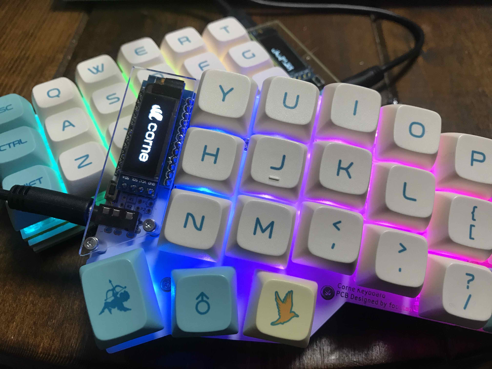

[前回作った自作キーボード](/entries/corne-cherry-build-log/)ですが、今回は LED をはんだ付けしてピカらせてみたのご紹介。

さっそく画像を載せておりますが、おしゃれになりました！カッコイイ！！！ :sparkles:

この CorneCherry は[ビット・トレード・ワン](https://bit-trade-one.co.jp/blog/20170717/)さんの方で買ったもので、はんだ付け要らずでパーツを差し込むだけで完成しましたが、今回行った LED の実装ははんだ付けをします！

#### LED をはんだ付けしてみて

LED のはんだ付けは色々なブログで難易度が高いと目にしていたため、私も気を張っていましたが、思っていた程ではなかったという印象でした。(はんだ付けなんて学生以来という私でも問題なく行えました)

LED は熱に非常に弱いらしく、はんだ付けを行う時の温度には気を付けなければいけません。

温度設定が出来るはんだごてを用意し、270℃ に設定して行えば熱で LED がダメになってしまう心配はそうそうないのかなという印象です。

実際、私は LED を熱でダメにしたものは１つもありませんでした。

付けたのに LED が点かない場合は、LED が壊れている心配よりも **はんだ付けが不十分でないか** や **LED の向き** を疑った方が良いと思います。

## 今回用意したもの

#### 白光 はんだごて

LED は熱に弱いため温度が超重要です！温度調節が出来るはんだごてを用意します

#### 白光 こて台

はんだごての台も買いました。私が購入したはんだごてと同じメーカーの白光さんのものを購入

#### 太洋電機産業 精密プリント基板用はんだ

はんだですが、こちらがペンみたいな形状で持ちやすそうだったので購入しました。

#### 太洋電機産業 ハンダ吸取線幅 2.0mm 長 1.5m

はんだ付けを失敗した時に、はんだを外すのに使う吸収線も用意しました。LED の向きを間違えるのはやりがちなので持っていて損はないでしょう。

#### SK6812MINI 10 個入り

基盤のバージョンが 2 系と 3 系で付ける LED が異なるので確認しましょう。私のはバージョン 2.1 だったので SK6812MINI を用意しました。

用意する LED は、[ビルドガイド](https://github.com/foostan/crkbd/blob/main/corne-cherry/doc/v2/buildguide_jp.md#led%E3%82%AA%E3%83%97%E3%82%B7%E3%83%A7%E3%83%B3) を確認しましょう。

## 必要なものが揃ったらはんだ付けを行なっていきます

[こちらのビルドガイド](https://github.com/foostan/crkbd/blob/main/corne-cherry/doc/v2/buildguide_jp.md#led%E3%82%AA%E3%83%97%E3%82%B7%E3%83%A7%E3%83%B3)を見ながら進めていきます。**順番** や **向き** があるのでしっかり確認しながら進めていきましょう。

はんだごての温度は 270℃ に設定して行いました。

写真の通り LED は結構小さいです。マスキングテープなどで固定してはんだ付けすると良いです。

左右合わせて 54 個の LED を淡々とはんだ付けしていきます。

裏面側(Undergrow)の LED の向きには注意です:exclamation: **左右** 、 **上段と下段** で向きが違います。私は何度かやらかしました :joy:

はんだ付け下手くそですがとりあえず光るのでヨシ！

こんな感じで全部赤色に光ればはんだ付け成功です :ok_hand:

光のパターンは[こちらのキーコード](https://docs.qmk.fm/#/feature_rgblight?id=keycodes)を入力することで切り替えられます。

以上で完成です！！！ :tada:
