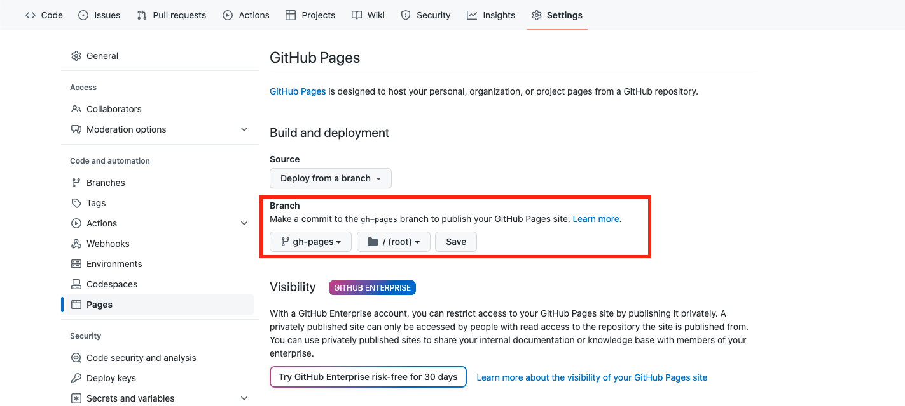

GitHub Actions でプロジェクトを GitHub Pages にデプロイする設定の手順を紹介していきます。

## 手順

#### 1. GitHub Actions のワークフロー作成

プロジェクトのルートディレクトリに **.github/workflow** ディレクトリを作成

```bash
mkdir -p .github/workflows
```

上で作ったディレクトリ下に **deploy.yml** を追加

```yaml
name: Deploy to GitHub Pages

on:
  push:
    branches:
      - master

jobs:
  build_and_deploy:
    runs-on: ubuntu-latest

    steps:
      - name: Checkout
        uses: actions/checkout@v2

      - name: Set up Node.js
        uses: actions/setup-node@v2
        with:
          node-version: 16

      - name: Install dependencies
        run: npm ci

      - name: Build
        run: npm run build

      - name: Deploy to GitHub Pages
        uses: peaceiris/actions-gh-pages@v3
        with:
          github_token: ${{ secrets.GITHUB_TOKEN }}
          publish_dir: ./build
```

GitHug Pages へのデプロイには、[peaceiris/actions-gh-pages](https://github.com/peaceiris/actions-gh-pages)アクションを使用しています。

**Create React App** はデフォルトでは、ビルド後の成果物は **./build** ディレクトリ下に作られるので、これを公開ディレクトリに設定します。

#### 2. **package.json** に以下を追加

```json
{
  ...
  "homepage": "https://yourusername.github.io/yourrepo/",
  ...
}
```

※　**yourusername** と **yourrepo** をあなたの GitHub ユーザー名とリポジトリ名に置き換えてください。

これはサブディレクトリにデプロイされたアプリケーションが正しく静的リソースを参照できるようにするための設定で、GitHub Pages は **/yourrepo** 下にデプロイされるので、これが必要になります。

これがないと、**画面が真っ白になる**などの問題が発生するので、確実に設定しましょう。

#### 3. 以上をコミットして、GitHub にプッシュ

上手く設定できていれば、GitHub Actions が走り、 **gh-pages ブランチ** が作成されます。

もしも権限エラーが出る場合は、以下の記事が参考になるかもしれません。

[GitHub Actions で GitHub Pages にデプロイしようとしたら Permission のエラーが出た](/entries/github-pages-deploy-actions-permissions)

#### 4. GitHub Pages の設定

プロジェクトのレポジトリの **Settings** タブを開いて、左ペインの **Pages** を開きます。

**Branch** の欄を **gh-pages /(root)** に設定し、Save します。



## 完了

以上で GitHub Pages に公開する手順は終了です。

[https://yourusername.github.io/yourrepo/](https://yourusername.github.io/yourrepo/) にアクセスするとページが表示されます :clap:
