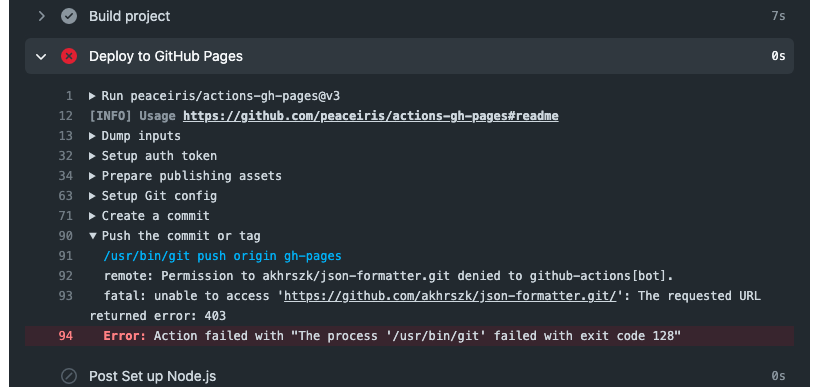
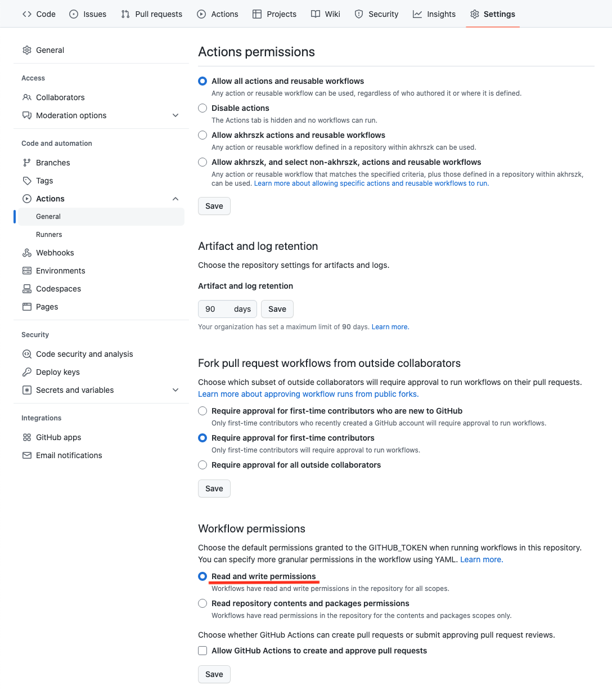

GitHub Actions で GitHub Pages へのデプロイの設定を久々にしてみるとハマったのでその解決法のまとめ。

ちなみに、GitHub Pages へのデプロイには、 [peaceiris/actions-gh-pages](https://github.com/peaceiris/actions-gh-pages) アクションを使いました。

そして、起こったエラーが以下。



なにやら、**Permission** やら **403** やらという単語が見えます。

GitHub Actions が gh-pages ブランチに push するのに権限エラーが起こっている模様。

ちなみに、GitHub Actions のワークフローは以下

```yml
name: Deploy to GitHub Pages

on:
  push:
    branches:
      - master

jobs:
  deploy:
    runs-on: ubuntu-latest
    steps:
      - name: Checkout repository
        uses: actions/checkout@v2

      - name: Set up Node.js
        uses: actions/setup-node@v2
        with:
          node-version: 14

      - name: Install dependencies
        run: npm ci

      - name: Build project
        run: npm run build

      - name: Deploy to GitHub Pages
        uses: peaceiris/actions-gh-pages@v3
        with:
          github_token: ${{ secrets.GITHUB_TOKEN }}
          publish_dir: ./build
```

**GITHUB_TOKEN** はちゃんと設定しているのになー、なんでだー。

## Actions permissions の設定

これの解決方法ですが、該当のレポジトリの **Settings** タブを開いて、左ペインの **Actions > General** を開きます。

すると、Actions permissions の設定ページが開きます。

一番下の Workflow permissions が **Read and write permissions** になっていることを確認しましょう。(なっていなかったら設定して Save)



GitHub Actions の権限はデフォルトでは Readonly になっているんですね。

う〜ん、前 GitHub Pages にデプロイの設定した時、こんな設定したかなあ :grey_question:
