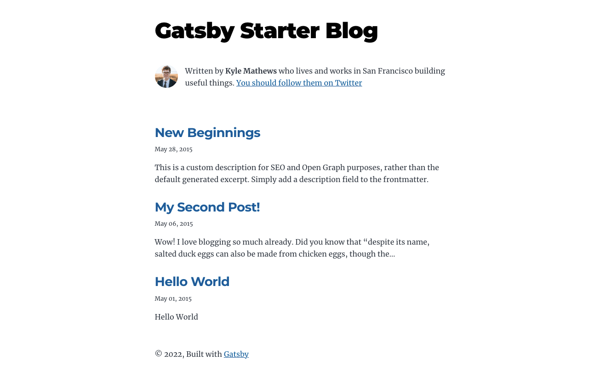

ブログを始めるのに Gatsby を選ぶメリットは色々あると思いますが、私が思いつくメリットは以下。

- markdown 記法で記事が書ける
- 記事を GitHub で管理できる
- Vercel を使えばデプロイが簡単
- Plugin が豊富
- React で書かれている(個人的趣味)

## Gatsby で Blog を作る

Gatsby でブログをはじめるのは驚くほど簡単。以下をコマンドを叩くだけ。

```bash
npx gatsby new gatsby-starter-blog https://github.com/gatsbyjs/gatsby-starter-blog
```

Gatsby の `gatsby-starter-blog` テンプレートの詳細は以下を参照。一緒にインストールされる Plugin 一覧などが載っている。

[Gatsby - gatsby-starter-blog](https://www.gatsbyjs.com/starters/gatsbyjs/gatsby-starter-blog)

インストールが完了したら、コマンドラインに表示されるままに作成されたディレクトリ下に移動して`gatsby develop`するとブログが立ち上がる。

```bash
Your new Gatsby site has been successfully bootstrapped. Start developing it by running:

  cd gatsby-starter-blog
  gatsby develop
```

`localhost:8000`をブラウザで開くとブログが表示される。



## Vercel にホスティング

[Gatsby Cloud](https://www.gatsbyjs.com/products/cloud/) というのもありますが、私は [Vercel](https://vercel.com/) を選びました。

両サービスをしっかり比較したわけではなので理由はとくに書きません。その他にも色々なホスティングサービスがあるので好きなところを選ぶと良いと思います。

Vercel は Next.js の開発元で、Next.js で作ったアプリをホスティングするの使われることが多いですが、Next.js の他にも Gatsby や CRA、Nuxt その他色々なフレームワークに対応しています。

Deploy は公式の以下のページに書いてある手順の通りですが、Vercel の管理画面から GitHub のリポジトリと連携するだけです。非常に便利。

[How to Deploy a Gatsby Site with Vercel #Vercel for Git](https://vercel.com/guides/deploying-gatsby-with-vercel#vercel-for-git)

新しく記事を追加するときも、GitHub に Push したら、自動でデプロイが走る。便利過ぎる。(語彙力)

以上、Gatsby でブログ作成 から デプロイまでの紹介でした。
