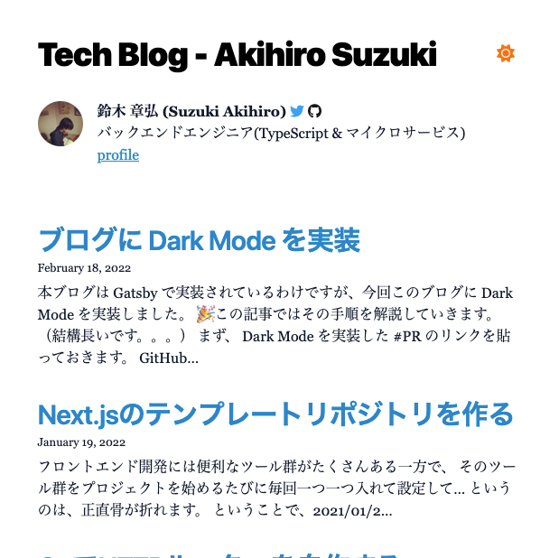
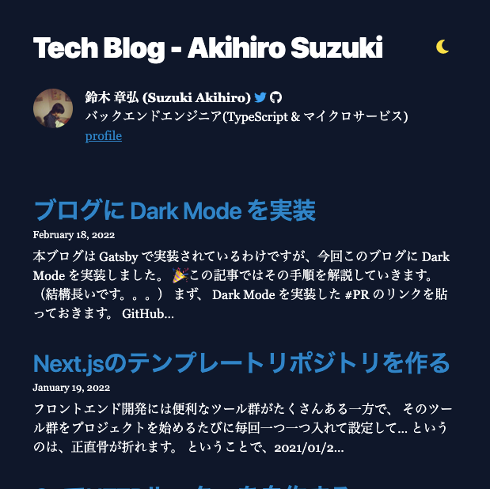

本ブログは [Gatsby](https://www.gatsbyjs.com/) で実装されているわけですが、今回このブログに **Dark Mode** を実装しました :thumbsup:

この記事ではその手順を解説していきます。

まず、 Dark Mode を実装した [#PR](https://github.com/akhrszk/blog/pull/5) のリンクを貼っておきます。

[GitHub - Introduce dark theme #5](https://github.com/akhrszk/blog/pull/5)

動作を確認したい人はこのブログの[ホーム](/)を開いて、右上の太陽マーク(または月マーク)をクリックすると、テーマが切り替わります。

## Tailwind CSS を導入

ダークテーマを実装するにあたり、CSS フレームワークを導入しました。
[TailwindCSS](https://tailwindcss.com/) が Dark Mode の切り替えにも対応していたのでこれを導入しました。

Tailwind CSS を使った Dark Mode については公式ドキュメントでも解説されています。

[tailwindcss - Dark Mode](https://tailwindcss.com/docs/dark-mode)

```html
<!-- Dark mode enabled -->
<html class="dark">
  <body>
    <!-- Will be black -->
    <div class="bg-white dark:bg-black">
      <!-- ... -->
    </div>
  </body>
</html>
```

このように `class` の指定で切り替えが出来るのでとても便利です :thumbsup:

Gatsby への Tailwind CSS の導入方法は、Tailwind CSS と Gatsby の両方から解説されています。

- [tailwindcss - Install Tailwind CSS with Gatsby](https://tailwindcss.com/docs/guides/gatsby)
- [Gatsby - Additional Guides > Tailwind CSS](https://www.gatsbyjs.com/docs/how-to/styling/tailwind-css/)

Tailwind CSS のイントールと設定が出来たら、スタイルシートを Tailwind CSS の記法に書き換えていきます。

これは地道にやるしかないですｗ ( めっちゃ大変 :joy: )

私が行った対応は以下です。

[GitHub - Introduce dark theme #5 :lipstick: rewrite with tailwindcss](https://github.com/akhrszk/blog/pull/5/commits/3576c0419be1eeba04181612bf265f7259e8b128)

## PrismJS の Theme を変更

PrismJS はコードブロックにテーマを適用してくれるライブラリですが、デフォルトのテーマだと Dark Mode にした時に明る過ぎます。

そこで Dark Mode、Light Mode どちらでも違和感ないテーマを選びます。

最初は、 **Dark Mode に切り替わったら PrismJS のテーマも切り替える** みたいな実装にしたかったのですが、方法が分からず :droplet:

PrismJS でデフォルトで用意されているテーマは以下です

[GitHub - PrismJS/prism](https://github.com/PrismJS/prism/tree/master/themes)

デフォルドで用意されているテーマを使っても良いのですが、今回は [prism-themes](https://github.com/PrismJS/prism-themes)を入れ、 _Lucario_ というテーマを使ってみました。

こんな感じです！

```go
package main

import "fmt"

func main() {
	fmt.Println("Hello, World")
}
```

ポケモンの[ルカリオ](https://zukan.pokemon.co.jp/detail/448)をイメージしたテーマらしいですが、赤緑で止まっている私はこのポケモンについてよく知りません。

## React Context API を使って Toggle ボタンを実装

CSS 周りの修正が終わったら、いよいよテーマの切り替えボタンなどを実装していきます。 :muscle:

React の [Context API](https://ja.reactjs.org/docs/context.html) を使った Dark Mode の実装について、Gatsby の公式ブログで解説している記事を見つけたので紹介します。 :eyes:

[Gatsby - Using React Context API with Gatsby](https://www.gatsbyjs.com/blog/2019-01-31-using-react-context-api-with-gatsby/)

上の解説ではクラスコンポーネントで実装されていますが、私は関数コンポーネントで実装したかったので、実装方法は多少異なりますが、参考にしながら以下のように実装しました。

```javascript
# theme.js

import React, { useCallback, useEffect, useState } from "react"

const light = "light"
const dark = "dark"

const defaultState = {
  theme: light, // light|dark
  toggleTheme: () => {},
}

export const ThemeContext = React.createContext(defaultState)

// Getting dark mode information from OS!
// You need macOS Mojave + Safari Technology Preview Release 68 to test this currently.
const supportsDarkMode = () =>
  window.matchMedia("(prefers-color-scheme: dark)").matches === true

export const ThemeProvider = ({ children }) => {
  const [theme, setTheme] = useState(light)

  const toggleTheme = useCallback(() => {
    setTheme(theme === light ? dark : light)
    localStorage.setItem("dark", JSON.stringify(!(theme === dark)))
  }, [theme])

  useEffect(() => {
    const lsDark = JSON.parse(localStorage.getItem("dark"))
    if (lsDark) {
      setTheme(dark)
    } else if (supportsDarkMode()) {
      setTheme(dark)
    }
  }, [])

  return (
    <ThemeContext.Provider value={{ theme, toggleTheme }}>
      {children}
    </ThemeContext.Provider>
  )
}


# ThemeToggleButton.js

import React, { useContext } from "react"
import { FontAwesomeIcon } from "@fortawesome/react-fontawesome"
import { faMoon, faSun } from "@fortawesome/free-solid-svg-icons"
import { ThemeContext } from "../lib/theme"

const ThemeToggleButton = ({ className }) => {
  const { toggleTheme, theme } = useContext(ThemeContext)
  const textColor = theme === "light" ? "text-orange-500" : "text-yellow-300"
  const styles = [
    textColor,
    "p-2",
    ...(className ?? '').split(' ')
  ]
  return (
    <button
      className={styles.join(' ')}
      onClick={() => toggleTheme()}
    >
      {theme === "light" ? <FontAwesomeIcon icon={faSun} size="lg" /> : <FontAwesomeIcon icon={faMoon} size="lg" />}
    </button>
  )
}

export default ThemeToggleButton

```

#### Gatsby で Context API を使う設定

`wrapRootElement` 関数を実装して `export` すると Gatsby が適切に呼び出してくれるので、上で実装した `ThemeProvider` で wrap して return します。

```javascript
# gatsby-browser.js

import { ThemeProvider } from "./src/lib/theme"

export const wrapRootElement = ({ element }) => (
  <ThemeProvider>{element}</ThemeProvider>
)
```

## おわりに

あとは適当な場所に Toggle ボタンを設置すれば完成です。 :tada:

以下の太陽ボタン(月ボタン)がそれです。

| _Light Mode_                              | _Dark Mode_                             |
| ----------------------------------------- | --------------------------------------- |
|  |  |
