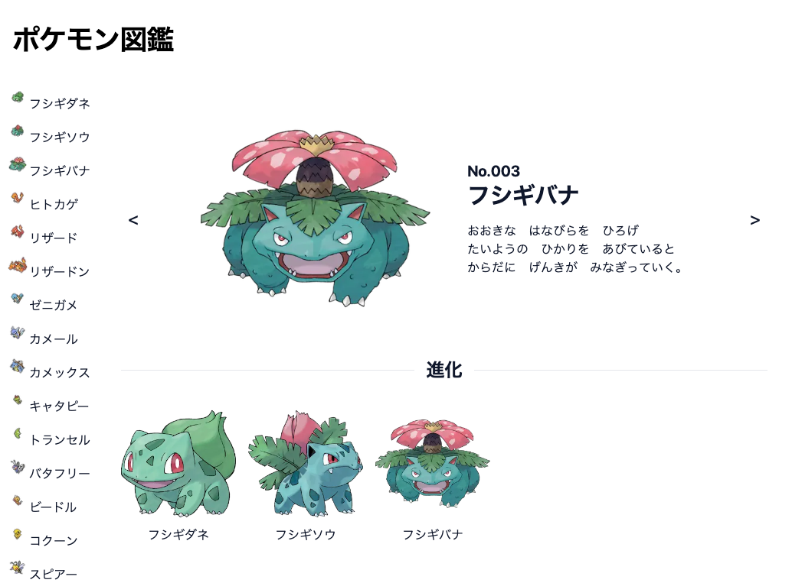
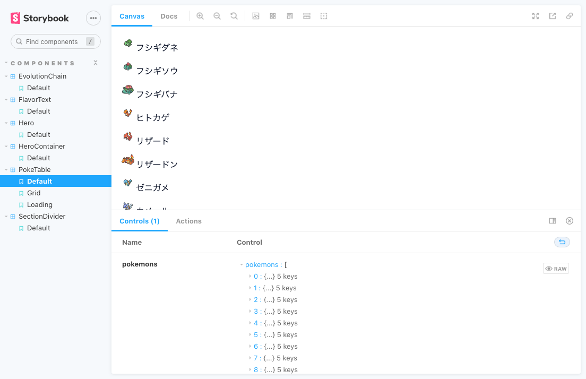
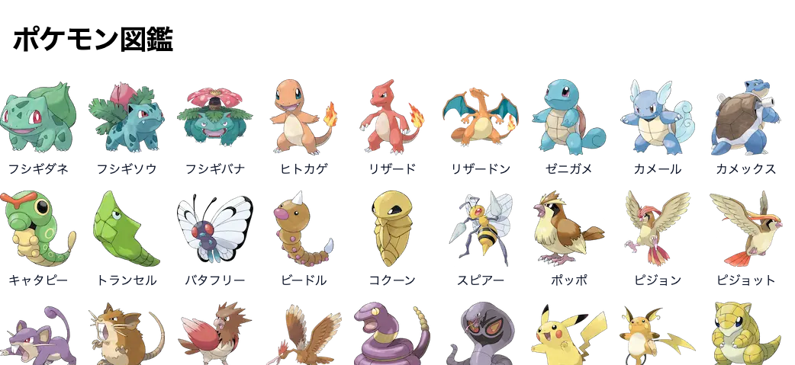

[](https://pokedex-nextjs-ecru.vercel.app/pokemons/3)

無料で使える API を使って [Next.js](https://nextjs.org/) でポケモン図鑑を作ってみたので紹介

[GitHub - akhrszk/pokedex-nextjs](https://github.com/akhrszk/pokedex-nextjs)

Vercel にデプロイしてあるので、[こちら](https://pokedex-nextjs-ecru.vercel.app/)から閲覧出来ます :thumbsup:

API は以下に紹介するものを組み合わせて使いました。

### PokéAPI

ポケモンの **説明** や **進化** などの情報の取得に使っています。

その他にもいろいろな情報が取得できるようです。

[](https://pokeapi.co/)

### Pokemon.json

GitHub で JSON ファイル や 画像ファイル が管理されています。

ポケモンの一覧取得や、画像ファイルはこちらを使っています。

[GitHub - fanzeyi/pokemon.json](https://github.com/fanzeyi/pokemon.json)

```json
# pokedex.json

[{
    "id": 1,
    "name": {
      "english": "Bulbasaur",
      "japanese": "フシギダネ",
      "chinese": "妙蛙种子",
      "french": "Bulbizarre"
    },
    "type": [
      "Grass",
      "Poison"
    ],
    "base": {
      "HP": 45,
...
```


## Next.js を使って実装

以前、[Next.js のテンプレートリポジトリを作っていたことがあり](/entries/nextjs-template)、せっかくなのでそれを使いました。

[GitHub - akhrszk/nextjs-template-with-typescript-tailwindcss-storybook](https://github.com/akhrszk/nextjs-template-with-typescript-tailwindcss-storybook)

技術スタックは、こちら

- TypeScript
- Tailwind CSS
- Storybook
- ESLint
- Prettier
- husky
- lint-staged

### StoryBook

StoryBook の立ち上げは以下のコマンドを実行

```bash
yarn storybook
```

:point_right: `http://localhost:6006/`



コンポーネント数は多くない。

なので、Atomic Design などにはしていないません。

### レイアウトの指定

Page コンポーネントに `getLayout` というメソッドを生やし、ページ単位でレイアウトを指定できるようにしました。ページのコードとレイアウトの指定が分かれるので良いのかなと思います:grey_exclamation:

参考にした公式のサンプルコードは以下

[Next.js - Layouts#per-page-layouts](https://nextjs.org/docs/basic-features/layouts#per-page-layouts)

今回は以下のように実装した

```typescript
# /src/pages/pokemons/[id].tsx

const PokemonIndex: NextPageWithLayout<Props> = () => (
  <>
    ...
  </>
)

PokemonIndex.getLayout = (page, { pokemons }) => (
  <DefaultLayout>
    <PokeDexLayout pokemons={pokemons}>{page}</PokeDexLayout>
  </DefaultLayout>
)

export default PokemonDetail


# /src/pages/_app.tsx

export type NextPageWithLayout = NextPage & {
  getLayout?: (page: ReactElement) => ReactNode
}

type AppPropsWithLayout = AppProps & {
  Component: NextPageWithLayout
}

function MyApp({ Component, pageProps }: AppPropsWithLayout) {
  const getLayout = Component.getLayout ?? (page => page)
  return getLayout(<Component {...pageProps} />, pageProps)
}
```

### SSG, ISR 対応

今回の実装では、SSG や ISR を使うようにしました。

Next.js で SSG や ISR をするには`getStaticProps` や `getStaticPaths`を実装することなります。このあたりは公式ドキュメントに詳しく書いています。

- [Next.js - getStaticProps](https://nextjs.org/docs/basic-features/data-fetching/get-static-props)
- [Next.js - getStaticPaths](https://nextjs.org/docs/basic-features/data-fetching/get-static-paths)
- [Next.js - Incremental Static Regeneration](https://nextjs.org/docs/basic-features/data-fetching/incremental-static-regeneration)

#### ISR の設定

ISR するときは注意する点がいくつかあって、以下で説明していきます

##### revalidate

`getStaticProps` で `revalidate` を指定してやることでページのキャッシュの有効期限を指定できます。

誰かがそのページにアクセスし、ページが生成されたら `revalidate` で指定された期間は、誰が訪れてもそのキャッシュされたページが返されます。

今回は、`revalidate`は敢えて設定しませんでした。その場合、ページが一度生成されたら、ずっとそのキャッシュを使い続けます。アプリの性質上ページが更新される類いのものではないので問題ないでしょう :grey_exclamation:

##### fallback: 'blocking'

`getStaticPaths` で `fallback: 'blocking'` を指定しています。

これは、まだページが生成されていない時、SSR の挙動になるものです。

##### prefetch

これは注意が必要です。:rotating_light:

prefetch が有効になっていると、Link コンポーネントがマウントされた時、リンク先のページが生成されます。（ちなみに、デフォルトは`true`）

`prefetch`を適切に設定していないと、Link がたくさん配置されたページが表示された時、**意図せず API リクエストが投げられまくる**ということが起こりかねない。:scream:

[Next.js - next/link](https://nextjs.org/docs/api-reference/next/link)

今回は、Index ページでは prefetch を`false`にしています。

[](https://pokedex-nextjs-ecru.vercel.app/)

#### 以上、ポケモン図鑑を作ってみた紹介でした。

今回は、 **Next.js を使って何かを作ってみる** ことが目的だったので、そこまで作り込めていません。また時間を見つけて更に手を加えていきたいと思っています。:laughing:
